# Healthcare AI


[](https://en.wikipedia.org/wiki/Machine_learning)

[](https://github.com/topics/academic-project)

## Project Overview

The **Healthcare AI Platform** is a web-based application designed to predict heart disease risk using machine learning models. Built with Flask, it provides an intuitive interface for users to input patient data, view predictions, explore the dataset, and analyze model performance through visualizations. The platform leverages a heart disease dataset (`heart.csv`) and employs multiple machine learning models, including Logistic Regression, Random Forest, and XGBoost, to deliver accurate predictions and insightful analytics.

This project is intended for **educational purposes only** and is not a substitute for professional medical advice, diagnosis, or treatment.

## Online Deployment

**Link**
   ```bash
   https://healthcare-online-deploment.onrender.com
   ```

## Features

- **Heart Disease Prediction**: Input patient data through a user-friendly form to predict the likelihood of heart disease, with probability scores and clear result presentation.
- **Dataset Exploration**: View the loaded heart disease dataset (up to 100 rows) in a tabular format.
- **Model Visualizations**: Analyze model performance with visualizations such as ROC Curve, Precision-Recall Curve, Confusion Matrix, and Model Metrics (Accuracy, F1 Score, Precision, Recall, AUC-ROC).
- **Patient Analytics**: Explore feature importance, correlation matrix, and patient distribution visualizations to understand data patterns and model behavior.
- **Error Handling**: Robust validation of input data and informative error messages via Flask flash messages.
- **Responsive Design**: Built with Tailwind CSS for a modern, responsive UI compatible across devices.

## Dataset

The system utilizes the standardized Heart Disease Dataset from Kaggle containing:

- **Size**: 303 patient records with 13 clinical predictors
- **Features**: Demographic, symptomatic, and diagnostic measurements
- **Target**: Binary classification (0 = No disease, 1 = Disease present)

| Feature | Description | Type |
|---------|-------------|------|
| `age` | Age in years | Numerical |
| `sex` | Sex (1 = male; 0 = female) | Categorical |
| `cp` | Chest pain type (0-3) | Categorical |
| `trestbps` | Resting blood pressure (mm Hg) | Numerical |
| `chol` | Serum cholesterol (mg/dl) | Numerical |
| `fbs` | Fasting blood sugar > 120 mg/dl | Binary |
| `restecg` | Resting ECG results | Categorical |
| `thalach` | Maximum heart rate achieved | Numerical |
| `exang` | Exercise induced angina | Binary |
| `oldpeak` | ST depression induced by exercise | Numerical |
| `slope` | Slope of peak exercise ST segment | Categorical |
| `ca` | Number of major vessels colored by fluoroscopy | Numerical |
| `thal` | Thalassemia type | Categorical |

## Model Architecture & Performance

### Performance Metrics

| Model | Accuracy | Precision | Recall | F1-Score | AUC |
|-------|----------|-----------|--------|----------|-----|
| Logistic Regression | 0.82 | 0.83 | 0.80 | 0.81 | 0.87 |
| Random Forest | 0.85 | 0.86 | 0.83 | 0.84 | 0.90 |
| Gradient Boosting | 0.87 | 0.88 | 0.85 | 0.86 | 0.92 |

## Technical Implementation

### Project Workflow

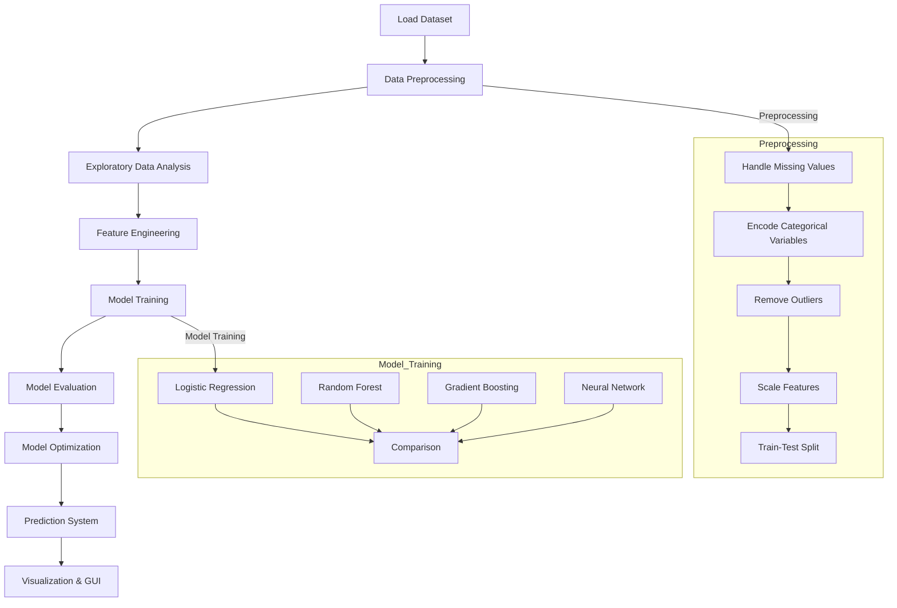

### Data Preprocessing Pipeline

1. **Missing Value Imputation**:
   - Numerical features: Median imputation
   - Categorical features: Mode imputation

2. **Outlier Detection & Treatment**:
   - IQR method for identification
   - Capping strategy for treatment

3. **Feature Transformation**:
   - One-hot encoding for categorical variables
   - StandardScaler for numerical features

4. **Train-Test Split**:
   - 80-20 split with stratification

### Feature Engineering

- **Interaction Features**:
  - Age × Cholesterol
  - Age × Blood Pressure

- **Binning**:
  - Age groups (30-45, 45-60, 60+)

- **Categorical Expansion**:
  - One-hot encoding: cp, thal, slope

## Key Insights

- **Primary Predictors**:
  1. ST depression during exercise (oldpeak)
  2. Chest pain type (cp)
  3. Thalassemia (thal)
  4. Maximum heart rate achieved (thalach)

- **Clinical Relevance**:
  - Strong correlation between exercise-induced angina and disease presence
  - Males demonstrate higher disease prevalence
  - ST depression emerges as the most significant predictor

- **Model Behavior**:
  - Gradient Boosting achieves highest accuracy and recall
  - Feature importance rankings align with established cardiovascular risk factors

### Setup Instructions

1. **Clone the Repository**
   ```bash
   git clone https://github.com/your-username/healthcare-ai-platform.git
   cd healthcare-ai-platform
   ```

2. **Create a Virtual Environment**
   ```bash
   python -m venv venv
   source venv/bin/activate  # On Windows: venv\Scripts\activate
   ```

3. **Install Dependencies**
   ```bash
   pip install -r requirements.txt
   ```

   Alternatively, install the libraries manually:
   ```bash
   pip install flask pandas numpy scikit-learn xgboost matplotlib seaborn
   ```

4. **Prepare the Dataset**
   - Ensure the `heart.csv` dataset is placed in the project root directory. The dataset should contain the following columns: `Age`, `Sex`, `CP`, `Trestbps`, `Chol`, `Fbs`, `Restecg`, `Thalach`, `Exang`, `Oldpeak`, `Slope`, `CA`, `Thal`, and `Target`.

5. **Run the Application**
   ```bash
   python app.py
   ```
   The application will start at `http://localhost:5000` (or the port specified in your environment).

## Usage

1. **Access the Application**
   - Open a web browser and navigate to `http://localhost:5000`.
   - The homepage displays a form to input patient data for heart disease prediction.

2. **Predict Heart Disease**
   - Fill in the patient data form with appropriate values for features like Age, Sex, Chest Pain Type, etc.
   - Submit the form to receive a prediction ("Disease Detected" or "No Disease Detected") along with a probability score.

3. **Explore the Dataset**
   - Navigate to the `/dataset` route to view the first 100 rows of the heart disease dataset in a tabular format.

4. **Model Visualizations**
   - Visit `/model_visualisations` to see performance metrics, ROC Curve, Precision-Recall Curve, and Confusion Matrix for the trained model.

5. **Patient Analytics**
   - Go to `/patient_visualisations` to view Feature Importance, Correlation Matrix, and Patient Distribution visualizations.

## Project Structure

```
healthcare-ai-platform/
│
├── app.py                  # Main Flask application
├── heart.csv              # Heart disease dataset (required)
├── static/
│   ├── images/            # Directory for generated visualization images
│   └── ...                # Other static assets (if added)
├── templates/             # (Optional) Directory for HTML templates
├── requirements.txt       # List of dependencies
└── README.md             # Project documentation
```

## Machine Learning Models

The platform trains three models and selects the best-performing one based on test accuracy:
- **Logistic Regression**: A linear model for binary classification.
- **Random Forest**: An ensemble model using decision trees.
- **XGBoost**: A gradient boosting model optimized for performance.

The models are trained on scaled features, with categorical variables one-hot encoded and missing values imputed (median for numeric, mode for categorical).

## UI
| Tabs | Screenshot |
|-------------|------------|
| Home | 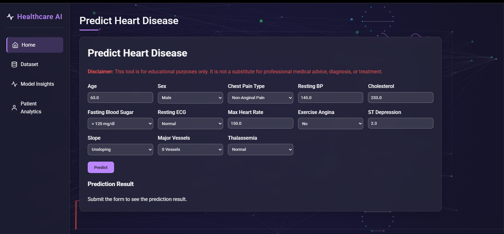 |
| Dataset | 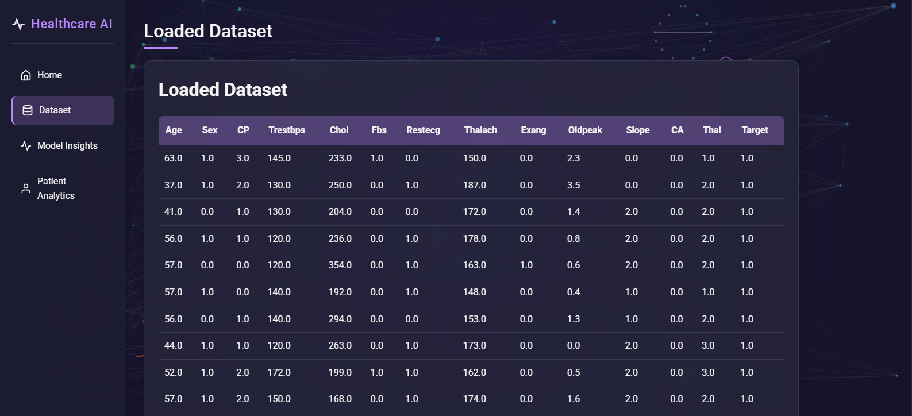 |
| Model Insights | 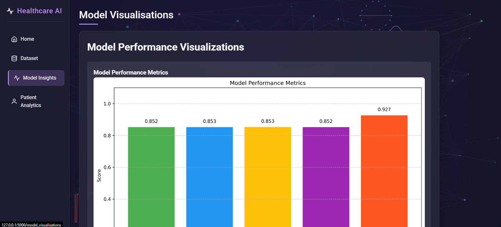 |
| Patient Analytics | 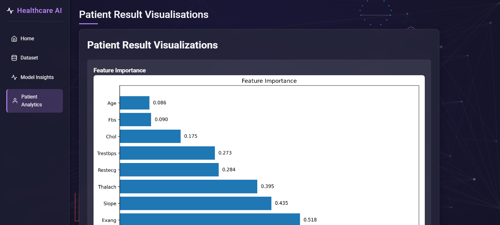 |

## Visualizations

The application generates the following visualizations:
| Visualization | Screenshot |
|-------------|------------|
| Model Metrics | 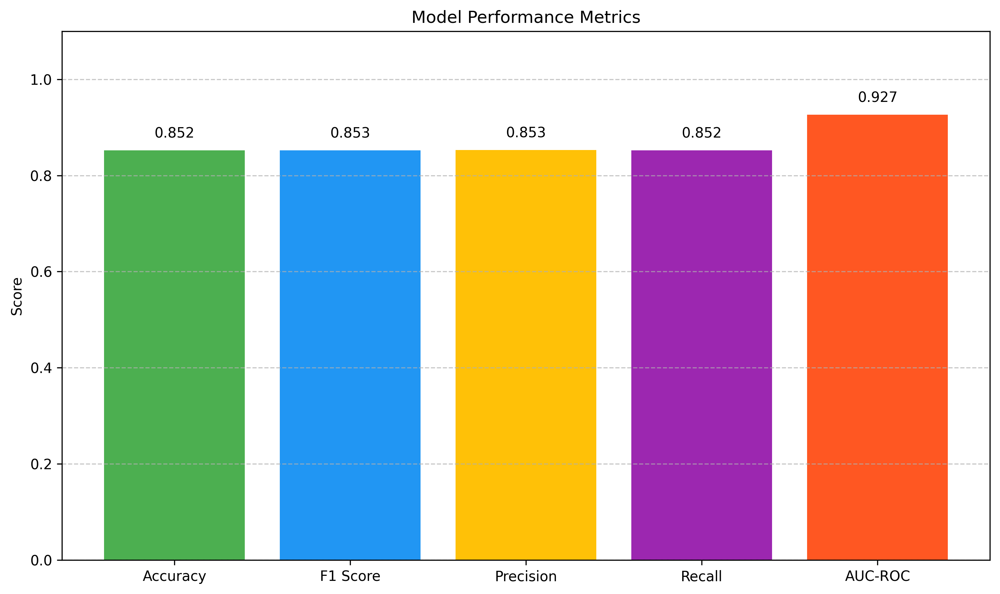 |
| ROC Curve | 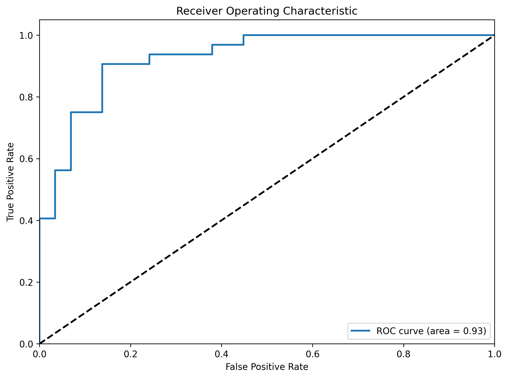 |
| Precision-Recall Curve | 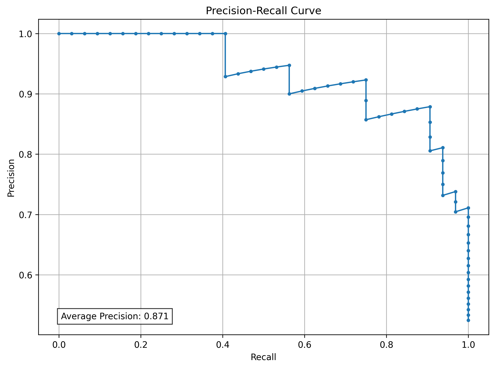 |
| Confusion Matrix | 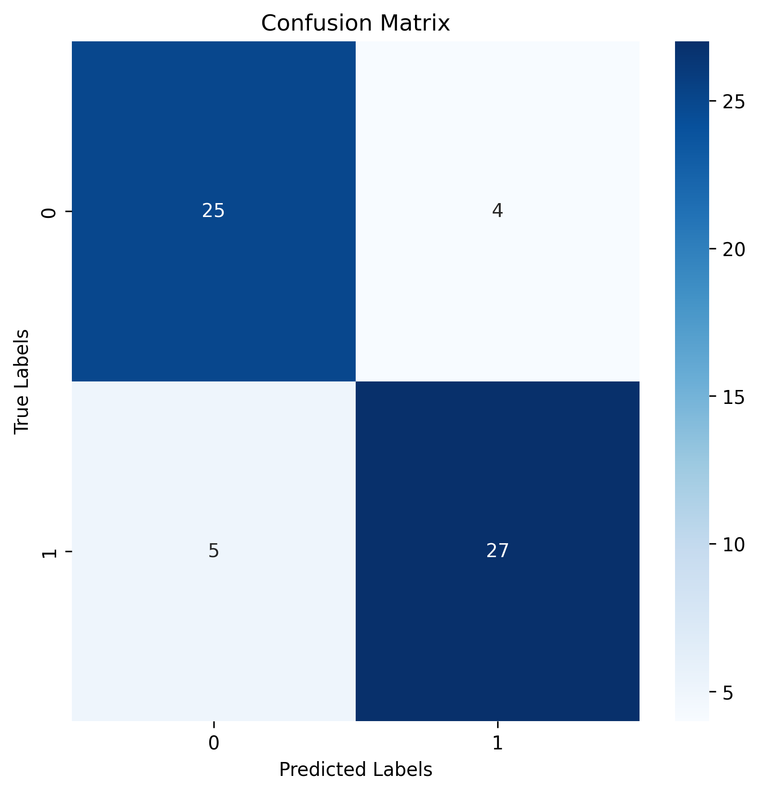 |
| Feature Importance | 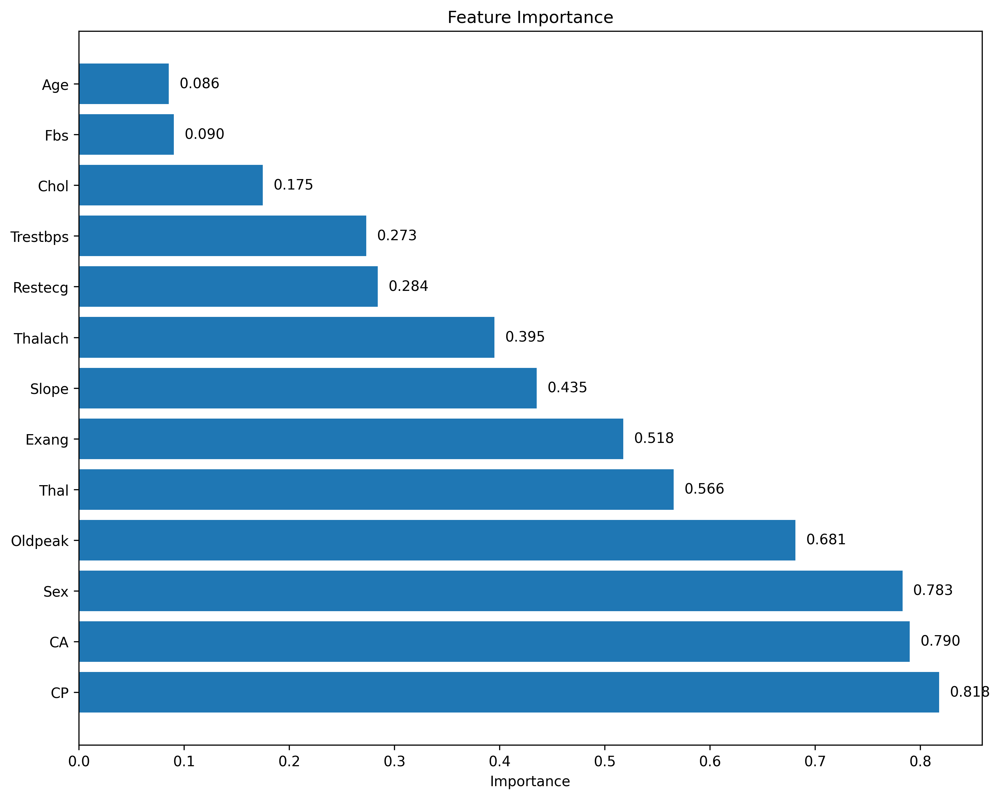 |
| Correlation Matrix | 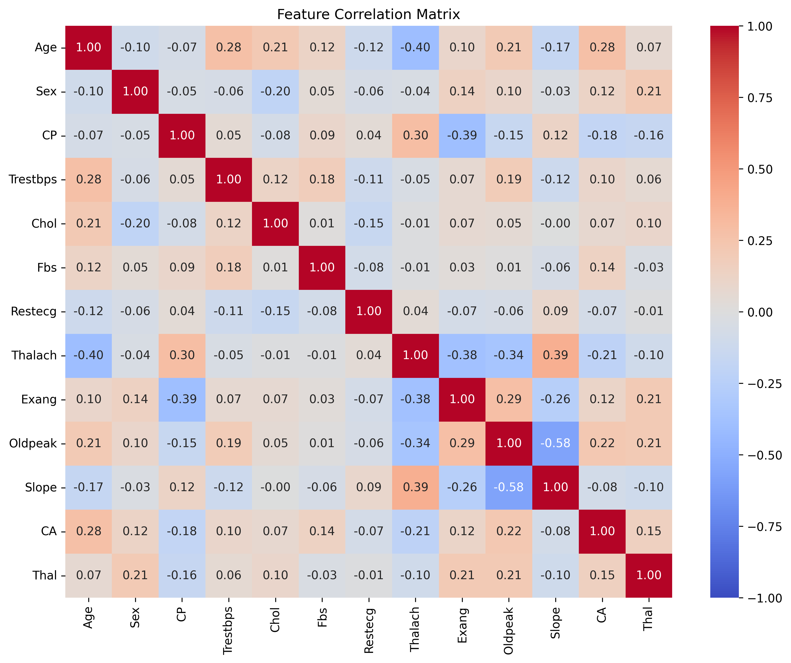 |
| Patient Distribution | 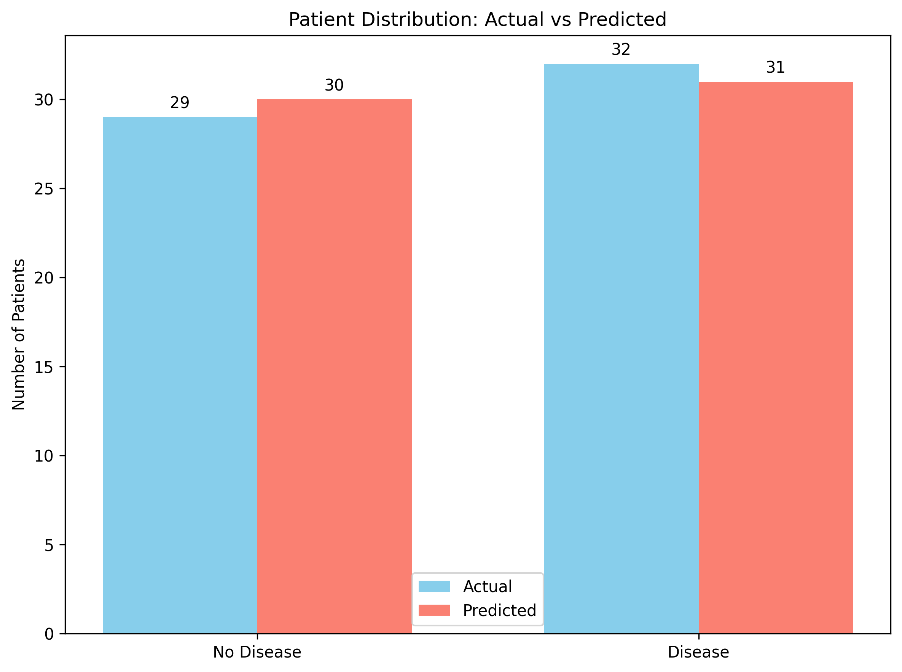 |

## Limitations

- **Educational Use Only**: The predictions are not intended for clinical use.
- **Dataset Dependency**: Requires a correctly formatted `heart.csv` file.
- **Binary Classification**: The current implementation assumes a binary target variable.
- **Visualization Limits**: Some visualizations (e.g., ROC Curve) are only generated for binary classification tasks.

## Team Members & Roles

| Name | GitHub | Role |
|------|--------|---------------|
| Sriram Kumar K | [@zerotwo1910](https://github.com/zerotwo1910) | Lead Developer and Machine Learning Engineer |
| Subasree M | [@suba-sree](https://github.com/suba-sree) | Front-End Developer and UI/UX Designer |
| Vanidha B | [@vani282005](https://github.com/vani282005) | Data Visualization Specialist |
| Shanthini S | [@shanthini1204](https://github.com/shanthini1204) | Data Engineer and Backend Developer |

## License

This project is licensed under the Apache License 2.0 - see the [LICENSE](LICENSE) file for details.

## Acknowledgements

- **Open-Source Community**: For developing and maintaining the powerful libraries used in this project, including Flask, Pandas, NumPy, Scikit-learn, XGBoost, Matplotlib, and Seaborn. These tools form the backbone of the application's functionality and visualizations.
- **Dataset Contributors**: To the creators and maintainers of the heart disease dataset (heart.csv) sourced from Kaggle. Special thanks to the Kaggle community for providing accessible and well-documented datasets that enable projects like this one.
- **Tailwind CSS Team**: For providing an intuitive and responsive CSS framework that enhances the user interface of the application.
- **Flask Community**: For their extensive documentation, tutorials, and forums that guided the development of the web application framework.
- **Machine Learning Community**: For the wealth of knowledge shared through blogs, research papers, and forums that inspired the implementation of machine learning models and visualization techniques.
- **GitHub Community**: For providing a platform to host, share, and collaborate on this project, enabling version control and community feedback.
- **Testers and Feedback Providers**: To friends, colleagues, or peers who tested the application, provided valuable feedback, and helped improve its usability and functionality.

## Citation

If you use this project in your research or work, please cite:

```
@software{heart_disease_prediction,
  author = {[Sriram Kumar K], [Subasree M], [Vanidha B], [Shanthini S]},
  title = {AI-Powered Heart Disease Prediction System},
  url = {https://github.com/zerotwo1910/healthcare-using-AI-online-deployment.git},
  version = {1.0.0},
  year = {2025},
}
```
